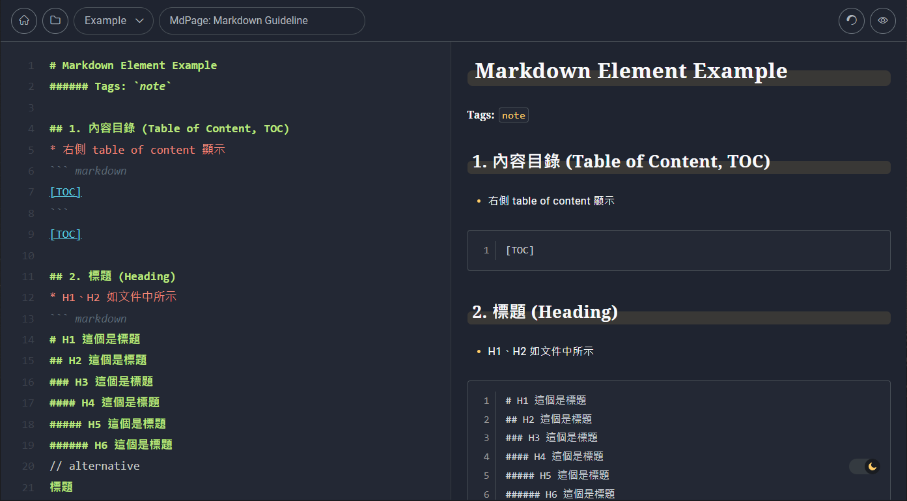
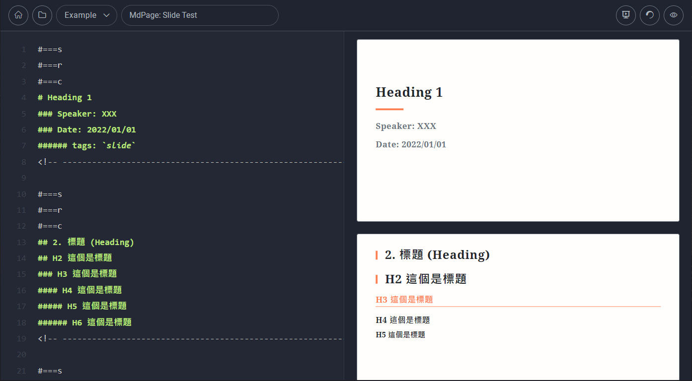

# Markdown Page (MdPage)
This repository provides a simple tool for taking note and making slide.
## Screenshot
Screenshot of markdown note

Screenshot of markdown slide


## Installation
1. Environment
    ``` text
    python==3.7.10
    Django==3.2
    ```
2. Run server
    ``` bash
    python manage.py runserver <ip address or localhost (default)>
    ```
3. Change default `username` and `password`
   * go to `http://<address>/admin/`
   * log in with default superuser
        ``` text
        username: admin
        password: Mdpage000
        ```
    * you can change to whatever you like
4. Checkout url `http://<address>` to the homepage
5. Go to `Example > Markdown Guideline: Note` and `Example > Markdown Guideline: Slide` page to see the detail of usages

## Powered by
* showdown
* codemirror
* mathjax
* list.js
* sortable.js
* prism.js
* split.js
